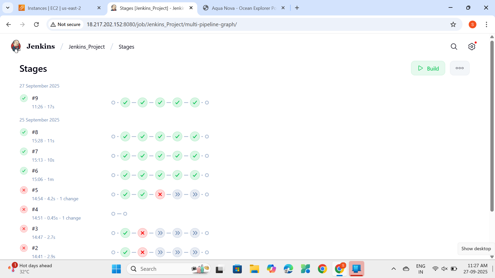
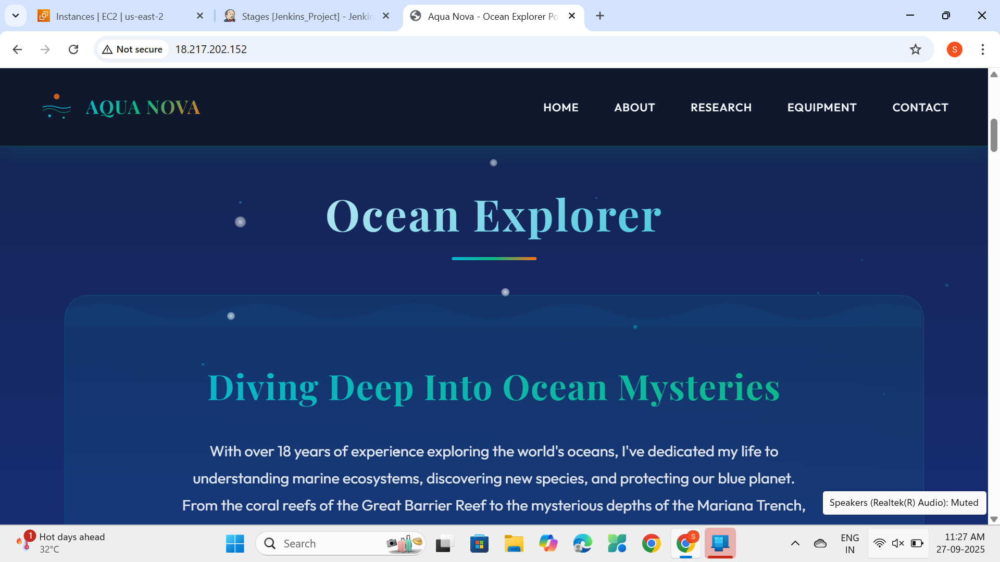

# 🚀 DevOps Major Project – CI/CD Pipeline with Jenkins, Docker & AWS

## 📌 Project Overview

This project demonstrates a complete **CI/CD pipeline** implementation using **Jenkins, Docker, and AWS EC2**.  
Whenever code is pushed to GitHub, Jenkins automatically:

1. Clones the repository
2. Builds a Docker image
3. Pushes the image to **DockerHub**
4. Deploys the container on an **AWS EC2 instance**

This ensures faster, automated, and reliable deployments with minimal manual effort.

---

## 🛠️ Technologies Used

- **Jenkins** – Continuous Integration & Deployment
- **Docker** – Containerization
- **AWS EC2** – Cloud Deployment
- **Git & GitHub** – Source Code Management

---

## 🚀 Steps to Run

### ✅ Step 1: Clone the Repository

```bash
git clone https://github.com/Shikha-1811/Jenkins_Project.git
cd Jenkins_Project

```

✅ Step 2: Configure Jenkins Pipeline

1. Open Jenkins Dashboard → Click New Item

2. Enter Job Name → e.g., DevOps-Major-CICD

3. Select Pipeline → Click OK

4. Under Pipeline settings:

   - Select Pipeline script from SCM

   - SCM → Git

   - Repository URL → Paste your GitHub repo URL

   - Script Path → Jenkinsfile

✅ Step 3: Add DockerHub Credentials in Jenkins

1. Go to Manage Jenkins → Credentials → Add Credentials

2. Select type → Username with password

3. Enter details:

   - Username → Your DockerHub username

   - Password → Your DockerHub password

   - ID → dockerhub-creds

4. Save the credentials

✅ Step 4: Run the Jenkins Pipeline

Once you build the pipeline, Jenkins will automatically:

- Clone the GitHub repo

- Build the Docker image

- Push the image to DockerHub

- Deploy the container on AWS EC2

✅ Step 5: Access the Application

After successful pipeline execution, the application can be accessed using the Public IP of your AWS EC2 instance:

http://<your-ec2-public-ip>

⚠️ Note: Since the EC2 instance was terminated after project completion (to avoid free-tier charges), the live link is not active. Please refer to the screenshots below for the output proof.

## 📸 Output Screenshots

### ✅ Jenkins Pipeline Success



### ✅ Application Running on EC2



👩‍💻 Author

Shikha – Cloud & DevOps Enthusiast
LinkedIn Profile - https://www.linkedin.com/in/shikha-pal-095b9a27b
